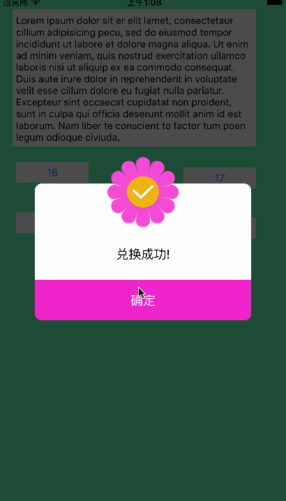

# LLHUD
蒙版弹窗



用法比较简单,当然功能也很简单(目前只有两种样式,HUDStyleMesseage和HUDStyleTelphone),按钮最多支持2个,以下给出几个事例:

#HUDStyleMesseage样式
也就是按钮16对应的蒙版
```objc
- (IBAction)Btn16:(id)sender {
    LLHUD *hub = [LLHUD HUDWithStyle:HUDStyleMesseage cancel:@"确定" other:nil];
    hub.message = @"兑换成功!";
    hub.iconImg = [UIImage imageNamed:@"HUD_sucess"];
    [hub show];
}
```


#HUDStyleMesseage|HUDStyleTelphone样式
也就是按钮17对应的蒙版
```objc
- (IBAction)Btn17:(id)sender {
    LLHUD *hub = [LLHUD HUDWithStyle:HUDStyleMesseage | HUDStyleTelphone cancel:@"取消" other:@"呼叫"];
    hub.message = @"兑换失败!请联系客服!";
    hub.telphoneNum = @"4008-000-000";
    hub.iconImg = [UIImage imageNamed:@"HUD_failure"];
    [hub show];
}
```
